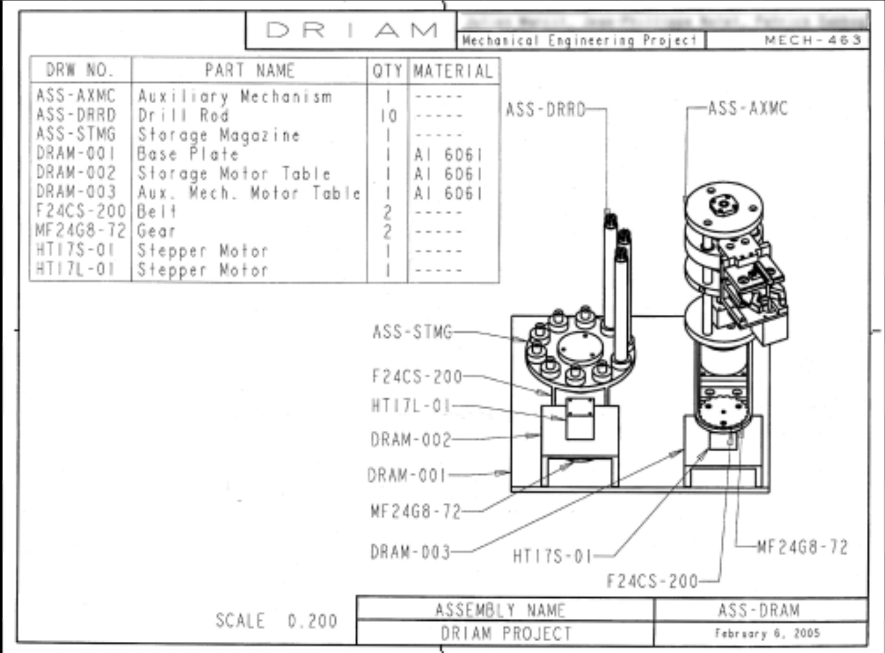
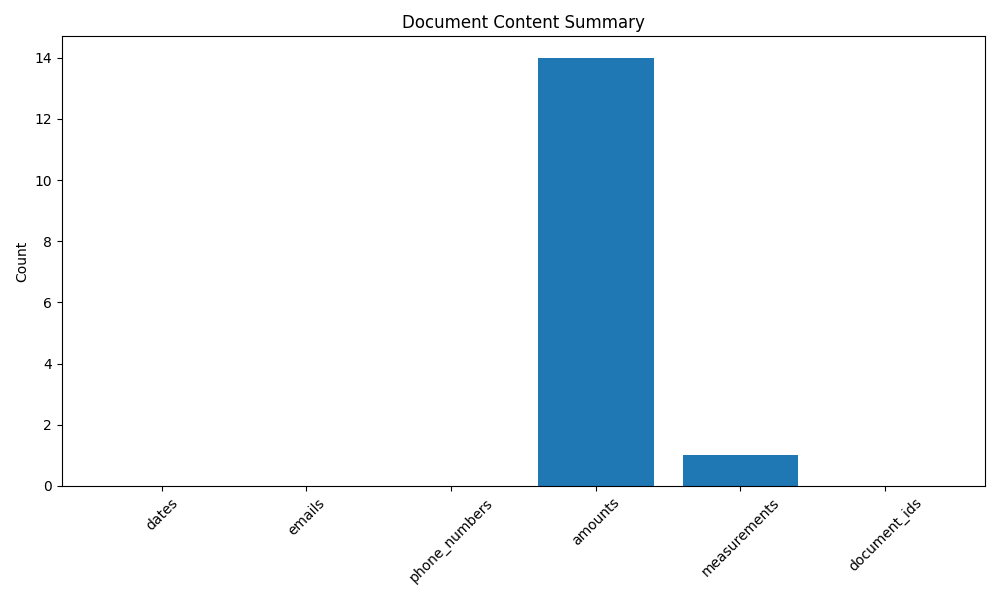

# Intelligent Document Processing System

## Overview
An advanced document processing system that leverages OCR (Optical Character Recognition) and Computer Vision techniques to extract, analyze, and process information from various document formats. This system is designed to handle technical documents, forms, and structured papers with high accuracy and efficiency.


## Features
- 🔍 Advanced OCR capabilities using Tesseract and EasyOCR
- 📊 Intelligent contour detection and region extraction
- 🔧 Robust image preprocessing pipeline
- 📝 Automated data extraction and categorization
- 📈 Customizable report generation (CSV, PDF)
- 📁 Support for multiple file formats (JPG, PNG, PDF)
- 🛠 Configurable processing parameters
- 📋 Detailed logging and error handling

## Sample Results

Here's an example of processing a technical document:

Input Image             |  Processed Output
:-------------------------:|:-------------------------:
  |  

The system automatically:
1. Detects and extracts text regions
2. Performs OCR on the detected regions
3. Extracts structured data (dates, measurements, IDs)
4. Generates detailed reports

## Tech Stack
- Python 3.9+
- OpenCV (Computer Vision)
- Tesseract/EasyOCR (OCR Engine)
- NumPy & Pandas (Data Processing)
- Matplotlib (Visualization)
- ReportLab/python-docx (Report Generation)
- PyTest (Testing)

## Installation

1. Clone the repository:
```bash
git clone https://github.com/yourusername/intelligent-doc-processing.git
cd intelligent-doc-processing
```

2. Create a virtual environment:
```bash
python -m venv venv
source venv/bin/activate  # On Windows: venv\Scripts\activate
```

3. Install dependencies:
```bash
pip install -r requirements.txt
```

4. Install Tesseract OCR:
- On macOS: `brew install tesseract`
- On Ubuntu: `sudo apt-get install tesseract-ocr`
- On Windows: Download installer from https://github.com/UB-Mannheim/tesseract/wiki

## Usage

Basic usage:
```python
from src.ocr.processor import DocumentProcessor
from src.vision.opencv_utils import ContourDetector

# Initialize processors
doc_processor = DocumentProcessor()
contour_detector = ContourDetector()

# Process a document
result = doc_processor.process("path/to/document.pdf")
```

For more detailed examples, check the [documentation](docs/USAGE.md) or the demo notebook in `examples/demo_notebook.ipynb`.

## Project Structure
```
intelligent-doc-processing/
├── src/
│   ├── ocr/          # OCR processing modules
│   ├── vision/       # Computer vision utilities
│   └── utils/        # Helper functions
├── tests/            # Unit tests
├── models/           # Trained models and weights
├── docs/             # Documentation
├── examples/         # Example notebooks
└── data/            # Sample data and outputs
```

## Contributing
Contributions are welcome! Please feel free to submit a Pull Request.

## License
This project is licensed under the MIT License - see the [LICENSE](LICENSE) file for details.

## Contact
For questions and support, please open an issue in the GitHub repository.